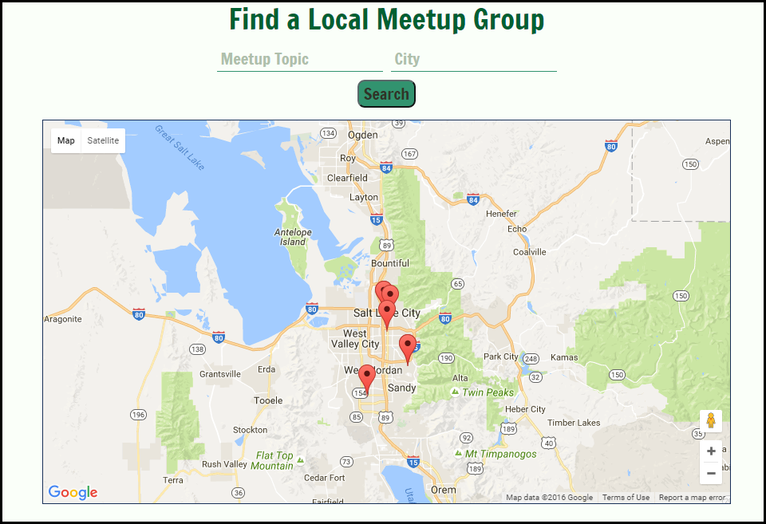
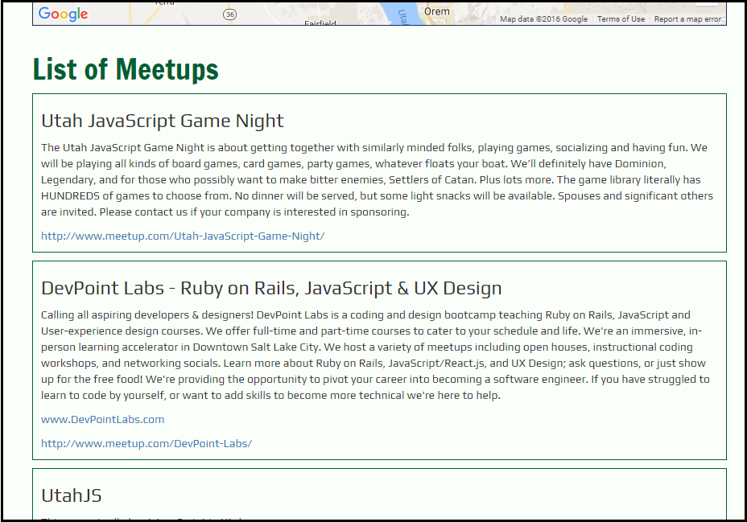

Meetup Finder
======

### Summary

This App allows you to search for meetups in your local area. The user types in the topic they are interested in finding meetups about, and also the city/location they are looking in. 

When the page first loads the default meetup search is for __JavaScript__ in __Salt Lake City__. From there a user can input their own searches.

In addition to the results populating the Google Map, a list of results gets appended below the map. I included this feature because some meetups use city names as their location and the map markers sit on top of eachother making it hard to see all the results.

### Technology Used

HTML/CSS/JavaScript/jQuery